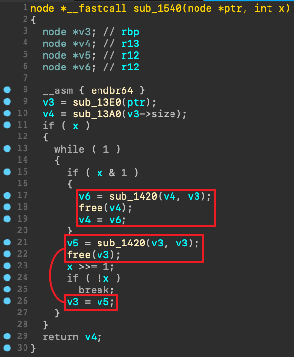

# Encrypted Lost Flag

- Category: `Reverse`
- Difficulty: `Medium`
- Solves: `5 / 327` (Pre-Exam)
- Keywords: `Matrix`

## Description

**ELF** is common in reverse.

Author: nella17

attachment: [chall](./dist/chall)

### Hint

[chall-unstrip](./dist/chall-unstrip)

## Write-up

### overview

這個程式會讀取一行 key，經過某種方式解密後輸出 flag。

### solution

如果將 binary 直接拖進 ida，會出現 plt 爛掉的問題，用 [PltResolver](https://github.com/veritas501/PltResolver) 插件就可以解決。<br>
ps: 如果用 ghidra 就沒問題ㄛXD

以下的 `address(hex)` 都是 [chall](./dist/chall) 的。

從 `main` 可以推測 `func_1350` 是 `init(size,str)`，也可以猜到 `func_1300` 是 `init(size)`，可以推測出這個東西的結構如下，`size*size` 可能是正方形的二維陣列。

```c
struct node {
    int size;
    int *ary;
}
```

`func_1600` 的參數是一段亂碼和輸入，看起來很像 `decrypt(char* enc,char* key)`。<br>
`func_14F0` 的參數只有一個 node，回傳值會直接被丟給 `puts`，可以推測是 `char* getstr(node* ptr)`。

`func_1540(node* ptr, int x)` 看到 `x & 1` 和 `x >>= 1` 及連續兩段相同的code，可以推測出這個函數是快速冪。<br>
看出是快速冪後，可以知道 `func_1420` 是乘法運算。<br>
ps: 可能是因為經過 O2 優化，L21-22 和 L26 分開ㄌ。 [source](./src/matrix.c#L152-L154)



往下追 `func_1420`，可以從 `a1->ary[i*a1->size+j] + a2->ary[j*a2->size+k]` 及下一行知道這是在 `mod 0x101` 下進行的矩陣乘法。<br>
ps: 因為 O2 優化，`% 0x101` 會被轉成乘法、加法和減法的運算，想瞭解更多可以參考 [How do compilers optimize divisions?](https://zneak.github.io/fcd/2017/02/19/divisions.html)。<br>
ps: ghidra 再次超越 ida。

逆到這邊就可以瞭解這隻 binary 是透過快速冪與矩陣乘法將密文解密。
```py
dec_m = enc_m * fpow(key_m, p32(key[-4:]))
```

經過快速冪的運算，會有很多組 key 都可以將密文解密。<br>
ps: 其中一組 key 是 `matrix_multiplication_can_use_everywhere`。

但求出 flag 不需回推 key，僅需計算反矩陣即可解出 flag。<br>
程式碼可以參考 [solve.c](./src/solve.c) 和 [solve.py](./src/solve.py)。
