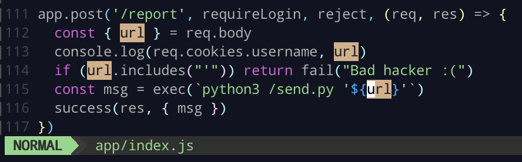

# SCIST 2021 資訊安全期末考

## Web

### Part 1 - Are you admin?

登入後可以觀察到 server 把 `username`、`password`、`is_admin` 存在 cookie。

將 `is_admin` 改為 `true` 即可拿到 flag1。

### Part 2 - Where is the source ?

從題目名稱可以知道 server 有任意讀檔的漏洞。

觀察網頁設計，可以發現它都是靜態畫面搭配 api 呼叫渲染畫面，存取任意不存在的 path、常見的 file read path，都會回傳 index.html。

可推~~通~~測~~靈~~知道 server 在 path 上將 `../` 替換掉了。

嘗試存取 `/etc/passwd` 發現 ForbiddenError，同時可以知道 source code 的位置。

這裡有個小坑，若向上走出 `/app` 就會觸發 ForbiddenError。

### Part 3 - Login as ADMIN ?

在 `/share.html` 有 XSS 漏洞，而且不限存取已登入帳號的 note。

雖然有 `replaceALL` 把 `on` 移除，但 `oonn` 就可以 bypass 限制，加上 part1 知道 password 存在 cookie 內，即可拿到 admin password。

詳細請見 [exploit.sh](./web/exploit.sh:L22-L28)

`SCIST{flag3_X5s_2_Leak_p4sswOrd}`

### Part 4 - Secret at `/flag4`

拿到 source code 後，在 L115 有 command injection，但需要 bypass `url` 沒有單引號的限制。

在 L19 可以知道 server 支援 extended urlencoded 的 body，可以讓 `url` 是 array，js 在 L115 會自動將 array join 成字串插入。

